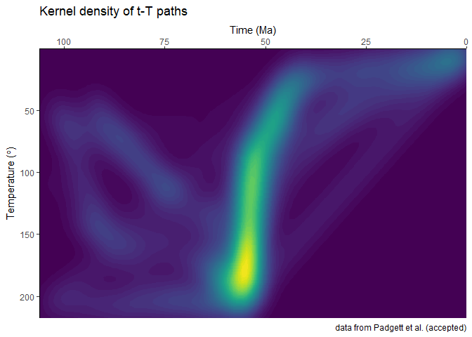

<!-- README.md is generated from README.Rmd. Please edit that file -->

# HeFTy_SmoothR

<!-- badges: start -->

[](https://github.com/joelpadgett/HeFTy_SmoothR/actions/workflows/R-CMD-check.yaml)
<!-- badges: end -->

Density plots derived from HeFTy inverse thermal history models as used
in Padgett et al. (accepted) and Johns-Buss et al. (submitted).

## Prerequisites

You must have R installed on your system (see <http://r-project.org>).
To install `HeFTy.SmoothR` from CRAN, type the following code at the R
command line prompt:

``` r
# install.packages("remotes") # install if needed
remotes::install_github("padgett/HeFTy_SmoothR")
```

The requirements for the import data are described in the detailed
walkthrough in the vignette:

``` r
vignette(package = "HeFTy.SmoothR")
```

The following code provides a minimal working example to demonstrate the
import and plotting of the data:

``` r
library("HeFTy.SmoothR")
library(ggplot2)

# load example data
path2myfile <- system.file("s14MM_v1.xlsx", package = "HeFTy.SmoothR") # example data
tT_paths <- read_hefty_xlsx(path2myfile)

plot_path_density_filled(tT_paths) +
  labs(
    title = "Kerndel density of t-T paths",
    caption = "data from Padgett et al. (accepted)",
    x = "Time (Ma)",
    y = bquote("Temperature (" * degree * ")")
  ) +
  theme_classic() +
  coord_cartesian(expand = FALSE) +
  scale_x_continuous(transform = "reverse", position = "top") +
  scale_y_continuous(transform = "reverse") +
  guides(fill = "none")
```



## Documentation

The detailed documentation can be found at

``` r
vignette(package = "HeFTy.SmoothR")
```

## Authors

Joel Padgett (<joel.padgett@ucalgary.ca>)

Tobias Stephan (<tstephan@lakeheadu.ca>)

## Citation

If you use this package in your research, please cite the following:

Padgett, J., Enkelmann, E., Kellett, D., Moynihan, D., and Stephan, T.
“Cenozoic exhumation and fault reactivation in southeastern Yukon
constrained by low-temperature thermochronology’. accepted for
publication in *Canadian Journal of Earth Sciences*. DOI:
10.1139/cjes-2024-0147.

## Feedback, issues, and contributions

I welcome feedback, suggestions, issues, and contributions! If you have
found a bug, please file it
[here](https://github.com/padgett/HeFTy_SmoothR/issues) with minimal
code to reproduce the issue.

## License

MIT License
