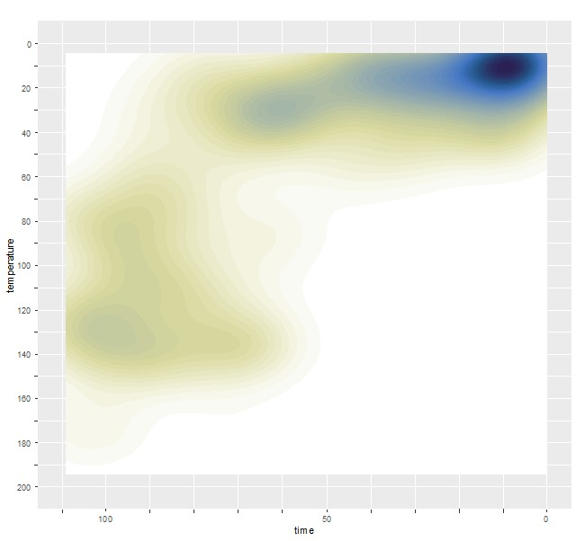

# HeFTy_SmoothR

Density plots derived from HeFTy inverse thermal history models as seen in Padgett et al. (submitted) and Johns-Buss et al. (submitted). 


## Prerequisites
You must have R installed on your system (see http://r-project.org). To install 
`HeFTy.SmoothR` from CRAN, type the following code at the R command line prompt:

```
# install.packages("remotes") # install if needed
remotes::install_github('padgett/HeFTy_SmoothR')

library('HeFTy.SmoothR')
```

The requirements for the import data are described in the detailed walkthrough in the vignette:
```
vignette(package = "HeFTy.SmoothR")
```

The following code provides a minimal working example to demonstrate the import 
and plotting of the data:

```
# load example data
path2myfile <- system.file('s14MM_v1.xlsx', package = 'HeFTy.SmoothR') # example data
tT_paths <- read_hefty_xlsx(path2myfile)


 plot_path_density_filled(tT_paths) +
  labs(title = "TITLE HERE", x = "Time (Ma)", y = bquote("Temperature ("*degree*")")) +
  theme_bw() + 
  scale_x_continuous(transform = "reverse") + 
  scale_y_continuous(transform = "reverse") +
  scico::scale_fill_scico_d(palette = "davos", direction = -1)
```
The code produces the following image:



## Documentation
The detailed documentation can be found at
```
vignette(package = "HeFTy.SmoothR")
```

## Authors
Joell padgett (<joel.padgett@ucalgary.ca>)

Tobias Stephan (<tstephan@lakeheadu.ca>)

## Feedback, issues, and contributions

I welcome feedback, suggestions, issues, and contributions! If you have
found a bug, please file it
[here](https://github.com/padgett/HeFTy_SmoothR/issues) with minimal code to
reproduce the issue.


## License
MIT License
