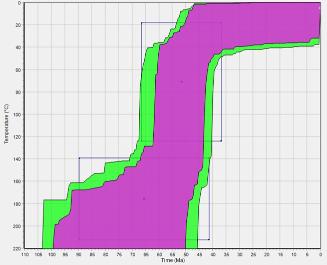
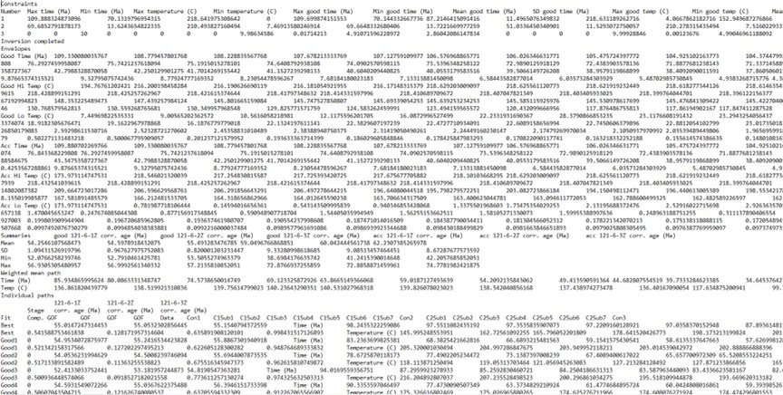
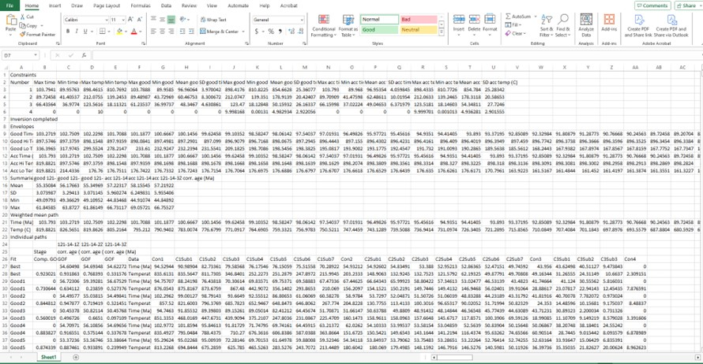
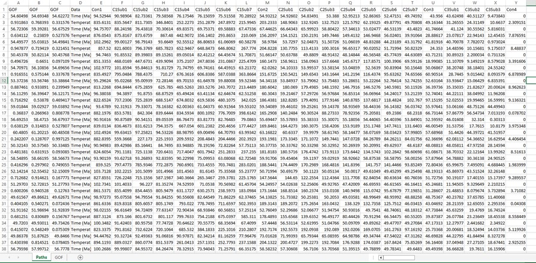
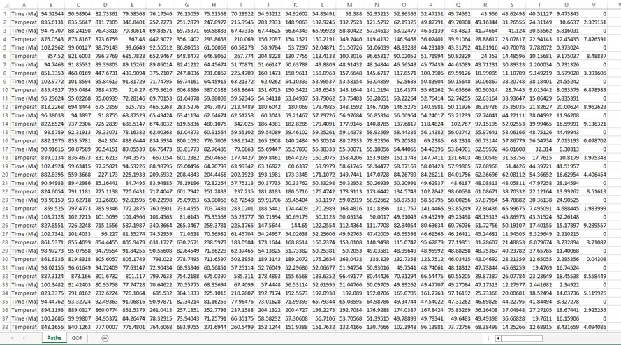
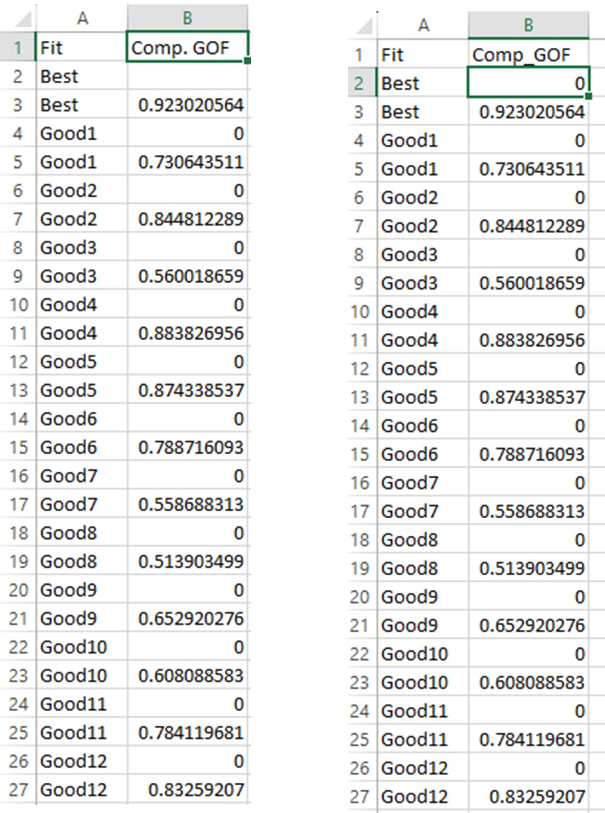
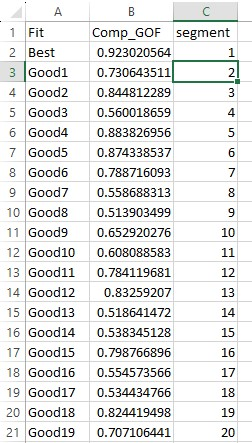

```{r setup, include=FALSE}
knitr::opts_chunk$set(
  collapse = TRUE,
  comment = "#>"
)
library(HeFTy.SmoothR)
```

## Some background

This document provides step-by-step instructions for producing density plots derived from HeFTy inverse thermal history models as seen in Padgett et al. (submitted) and Johns-Buss et al. (submitted). Part I explains how to export data from HeFTy and create an excel spreadsheet to load into R. Part II explains how to run the R code to produce the density plots. This tutorial assumes you have R and RStudio downloaded and installed. 


```{r packages1, eval=FALSE, include=TRUE}
install.packages("scico")
library(scico)

install.packages("scico")
```
```{r packages2}
library(ggplot2)
```


```{r packages3, eval=FALSE, include=TRUE}
remotes::install_github("joelpadget/HeFTy_SmoothR")
library(HeFTy.SmoothR)
```

## Prepare your HeFTy output

1. Export tT data 
  -	Open a thermal history model file (.hft or .hfm) in HeFTy. Once open, click on the “Inverse Modeling” button in the top left. Make sure your inverse modeling results are visible in your time-temperature window. 
  
 

  
  -	Right-click inside the time-temperature window (for example, the location of the “X” in Figure 1).  Scroll down to “Export”. Click “Save as Text”. Save the .txt file. The text file should look similar to Figure 2.
  -	Open a new excel (.xlsx) file. Copy all the text from the text file. Click on cell A1 in the newly-created and paste the copied-text. Your excel sheet should now look similar to the excel sheet in Figure 2. 

 {width=75%}


2. Prepare tT Paths spreadsheet
  -	Rename the sheet from “Sheet1” to “Paths”.
  -	Find the row that reads (from column A to the right): “Fit”, “Comp. GOF”, … In Figure 3 this is row 26. Keep this row and delete every row in the table above this one. The result should look like Figure 4. 
  
  
   {width=75%}
   
   {width=75%}
   
  -	Scroll to the rightmost column in the data sheet. This will vary for each sample depending on the model setup. In Figure 3, this is column AA.
  -	Create a new sheet in the same .xlsx file. Call it “GOF”.
  -	Copy columns A and B (named “Fit” and “Comp. GOF”) from the Paths sheet and paste them into the first two columns in the GOF sheet. Delete these columns from the Paths sheet. The resulting paths spreadsheet should look similar Figure 4. Return to the Paths sheet. 
  -	Delete row 1 from Paths sheet. 
  -	Find the column with that reads (from row 1 down): “Time (Ma)”, “Temperature”, “Time (Ma)”, “Temperature” … This is column D in Figure 4. Delete all columns before this one. The resulting table should look similar to Figure 5. 
  
   {width=75%}
  
  -	Find the last column in the data table (column V in Figure 6). Values in this column should alternative 0 and a number, 0, and a number. Check that this pattern in maintained through the whole column. Also ensure that every row in the table ends at column V. 

 {width=50%}

3. Prepare GOF spreadsheet
  -	Open the GOF spreadsheet. 
  -	Rename column B from “Comp. GOF” to “Comp_GOF”. Important: make sure there are no spaces in the column name.
  -	Fill in this cell B2 with a “0”. It will likely be blank when you first paste these columns in the GOF sheet. If there is a non-zero value in cell B2, replace it with a 0. The resulting spreadsheet should look like Figure 6.
  
   {width=50%}
   
  -	Select all of the data in the spreadsheet and under Sort & Filter click Filter. Click the dropdown arrow for Column B. Uncheck “Select All” and then check “0”. The resulting table should look similar to Figure 7.
   {width=50%}
   
  -	Select all of the filtered records and delete them. Note: if there are lots of records, you may need to do this in batches. 
  -	Turn off the filter to view all of the remaining records. Check that cell the column labels are still in row 1 and that cell B2 says “Best”. Also check that every cell in column B has a numerical value in it. The values in column B should be decreasing. 
  -	In cell C1, write the word “segment”. Be sure to write it exactly like this, all lower case and without a space after the “t”. 
  -	Type the number “1” in cell C2. 
  -	In cell C3, type the following equation (without the quotation marks): “= 1 + C2”. Apply this equation to all cells in the row by clicking on the cell and then double-clicking on the small box that appears in the bottom right corner of the cell. See Figure 8.
  -	Copy all of column C and paste it as values into column D (right click and choose paste as values). Columns C and D should now look the same. Now delete Column C. The final table should look like Figure 8.
  
   {width=50%}
   
  -	Save the spreadsheet as a .xlsx file.

## Load Input Data ------------------------------------------------------

Open R and define the path to your .xlsx file. For example:
```{r fname,eval=FALSE}
path2myfile <- "A:/Joel Padgett/Y121_Data/HeFTy_v2.0_Models/Y121_paths/Y121_paths.xlsx"
```

> Be aware that R uses forwardslashes (/) to separate folders. 

```{r fname2, include=FALSE}
path2myfile <- system.file("s14MM_v1.xlsx", package = "HeFTy.SmoothR")
```

Next, you import the excel file into R by using the function `read_hefty_xlsx()`:
```{r data,warning=FALSE, message=FALSE}
tT_paths <- read_hefty_xlsx(path2myfile)
```

## Plot the path density ---------------------------------------------


To plot the density of the paths, you simply use the function `plot_path_density()`:

```{r seed1, include=FALSE}
set.seed(123)
```

```{r plot1, out.width="100%"}
plot1 <- plot_path_density_filled(tT_paths, show.legend = FALSE)
plot1
```

This uses the package's default values for smoothing and binning and creates a `ggplot` type graphic. 


You can customize the smoothing and density binning by changing the parameters
- `bins` - the number of filled contours.
- `GOF_rank` - Selects only the n highest GOF ranked paths.
- `densify` - Should extra points be added along the individual paths to avoid that only the vertices of the path are evaluated? 
- `n` - How many equally-spaced extra points should be added along between the vertices of the path (if `densify=TRUE`).
- `samples` - Size of a random subsample of all the paths to reduce the computation time.


```{r seed2, include=FALSE}
set.seed(123)
```

```{r plot2, out.width="100%"}
plot2 <- plot_path_density_filled(tT_paths, bins = 25, GOF_rank = 5, densify = TRUE, n = 100, samples = 100, show.legend = FALSE)
plot2
```

Finally, you can customize your ggplot, such as axes labels, change colors, and reverse the axes: 

```{r plot3, out.width="100%"}
plot2 +
  labs(title = "TITLE HERE", x = "Time (Ma)", y = bquote("Temperature (" * degree * ")")) + # type title of plot and put in double quotes
  theme_bw() + # sets a ggplot theme
  coord_cartesian(xlim = c(110, 0), ylim = c(200, 0), expand = FALSE) + # set x and y limits of plot
  scale_x_continuous(breaks = seq(0, 110, 25), transform = "reverse") + # set the major ticks: (breaks = seq(0, 110, 50) --> axis major ticks go from 0 to 110 with divisions of 50.
  scale_y_continuous(breaks = seq(200, 0, -20), transform = "reverse") + # set the major ticks: (breaks = seq(200, 0, -20) --> axis major ticks go from 220 to 0 with divisions of 20 (negative because 0 is at the top of the plot). 
  scico::scale_fill_scico_d(palette = "davos", direction = -1) # view available color palette options: https://www.data-imaginist.com/posts/2018-05-30-scico-and-the-colour-conundrum/
```

